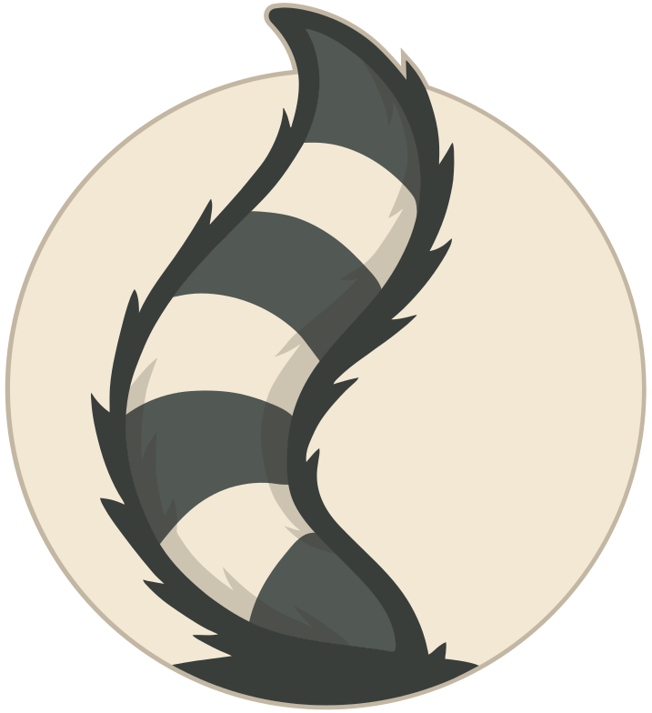

<table style="border: none;">
<tr>
<td style="border: none; vertical-align: middle;">
  
</td>
<td style="border: none; vertical-align: middle;">
  <h1>Eventail</h1>
  <p>A tiny, typed priority event emitter abstract class that makes complex event handling easy.</p>
</td>
</tr>
</table>

[](https://www.npmjs.com/package/eventail)
[](https://opensource.org/licenses/MIT)
[](https://www.typescriptlang.org/)

## Features

- 🎯 Priority-based event handling
- 🌟 Single and one-time event listeners
- 🔄 Context binding support
- ⚡ Lightweight and efficient
- 📦 Full TypeScript support
- 🧪 Zero dependencies

## Installation

```bash
npm install eventail
```

## Usage

### Basic Event Handling

Extend Eventail and register event handlers:

```typescript
import { Eventail } from 'eventail';

// Define event names as enum for better type safety
enum PlayerEvents {
  EXPERIENCE_GAINED = 'experienceGained',
  LEVELED_UP = 'leveledUp'
}

// Create a player character
class Player extends Eventail {
  private static readonly experienceFactor = 100;
  private level = 1;
  private experience = 0;

  public gainExperience(amount: number) {
    this.experience += amount;
    this.emit(PlayerEvents.EXPERIENCE_GAINED, amount, this.experience);

    if (this.experience >= this.level * Player.experienceFactor) {
      this.level++;
      this.experience = 0;
      this.emit(PlayerEvents.LEVELED_UP, this.level);
    }
  }
}

const player = new Player();

// Regular event listener
player.on(PlayerEvents.EXPERIENCE_GAINED, (amount, total) => {
  console.log(`Gained ${amount} XP (Total: ${total})`);
});

// With context and priority
const ui = {
  showNotification(message: string) {
    console.log(`[${this.prefix}] ${message}`);
  },
  prefix: 'UI'
};

player.on(PlayerEvents.LEVELED_UP, (level) => ui.showNotification(`Level up! Now level ${level}`), ui, -10);  // High priority
```

### One-Time Events

Listen for events that should only trigger once:

```typescript
// One-time event listener
events.once('init', () => {
  console.log('Initialized - this runs only once');
});

// With context and priority
events.once('ready', handler.process, handler, 75);
```

### Priority System

Lower numbers = higher priority:

```typescript
// High priority (-50) - using string event
events.on('event', () => console.log('First'), undefined, -50);

// Default priority (0) - using number event
events.on(42, () => console.log('Second'));

// Low priority (50) - using string event
events.on('event', () => console.log('Third'), undefined, 50);
```

### Removing Listeners

Remove specific or all listeners:

```typescript
// Remove specific listener - string event
const callback = (data) => console.log(data);
events.on('event', callback);
events.off('event', callback);

// Remove all listeners for an event - string event
events.off('event');
```

### Event Emission

Use the protected emit method in derived classes:

```typescript
// Define event names as enum for better type safety
enum GameObjectEvents {
  HEALTH_CHANGED = 'healthChanged',
  DIED = 'died'
}

class GameObject extends Eventail {
  private health = 100;

  public takeDamage(amount: number) {
    this.health = Math.max(0, this.health - amount);
    // Emit internal state change event
    this.emit(GameObjectEvents.HEALTH_CHANGED, this.health);

    if (this.health <= 0) {
      this.emit(GameObjectEvents.DIED);
    }
  }
}

const gameObject = new GameObject();
gameObject.on(GameObjectEvents.HEALTH_CHANGED, (health) => console.log('Health:', health));
gameObject.on(GameObjectEvents.DIED, () => console.log('Game Over'));

gameObject.takeDamage(50); // Health: 50
gameObject.takeDamage(60); // Health: 0, Game Over
```

## API Reference

### `on(type: string | number, callback: Callback, context?: object | Symbol, priority = 0): this`
Registers an event listener.
- `type`: Event name (string or number) to listen for
- `callback`: Function to call when event occurs
- `context`: (optional) `this` context object or Symbol for callback
- `priority`: (optional) Priority level, lower = higher priority (default: 0)

**Note**: Listeners with the same priority have undefined execution order.

### `once(type: string | number, callback: Callback, context?: object | Symbol, priority = 0): this`
Registers a one-time event listener.
- Same parameters as `on()`
- Automatically removes itself after first execution

**Note**: Listeners with the same priority have undefined execution order.

### `off(type: string | number, callback?: Callback, context?: object | Symbol): this`
Removes event listener(s).
- `type`: Event name (string or number)
- `callback`: (optional) Specific callback to remove. If not provided, removes all listeners for the event
- `context`: (optional) Specific context object or Symbol to match when removing

### `protected emit(type: string | number, ...args: unknown[]): boolean`
Protected method for emitting events internally.
- `type`: Event name (string or number) to emit
- `args`: Arguments to pass to listeners
- Returns: `true` if event had listeners

**Note**: This method is protected to allow the inheriting class to emit events internally when its state changes, maintaining encapsulation by preventing external entities from directly triggering events.

## License

MIT © [jango](https://github.com/jango-git)

## Contributing

Contributions are welcome! Please feel free to submit a Pull Request.
